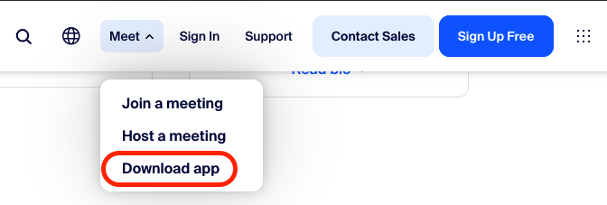
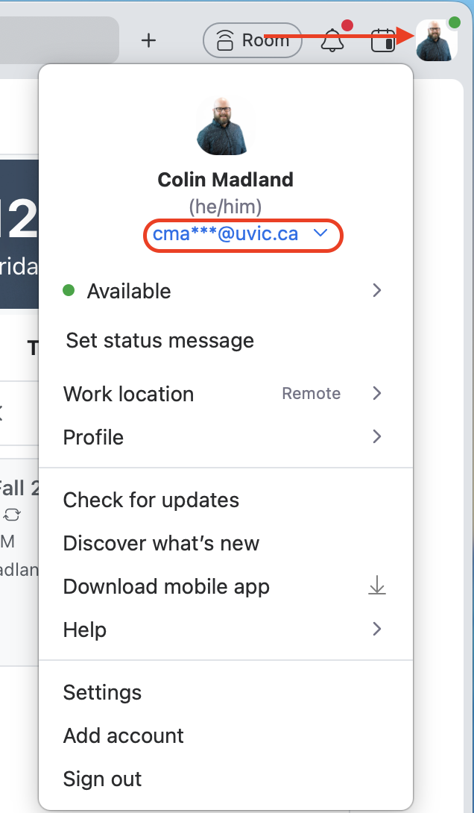
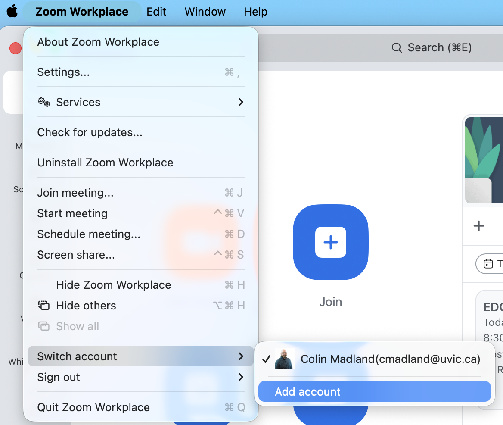
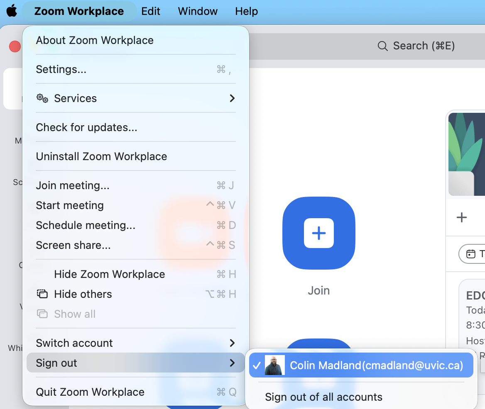
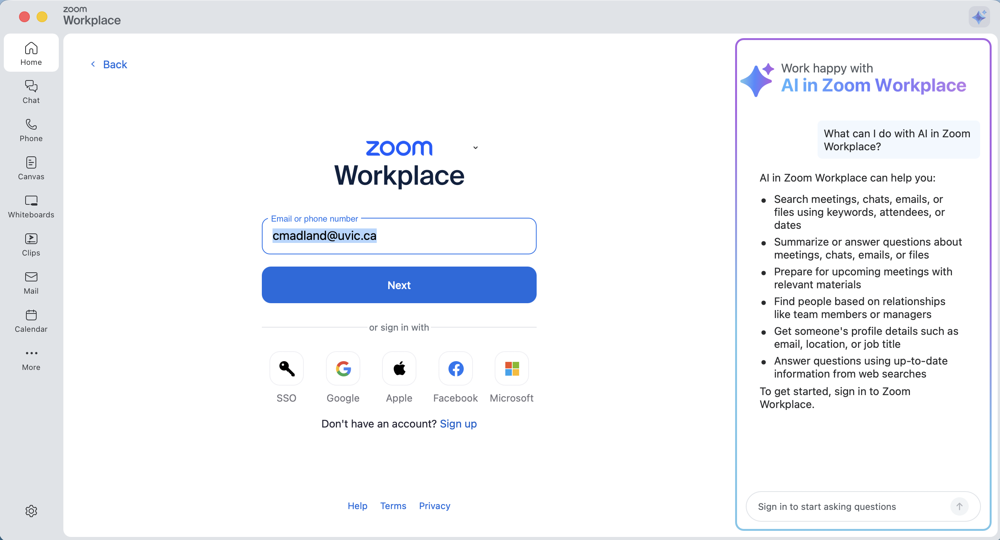

Hi folks,

Rather than reply individually, I'll post some pointers here on ensuring you are signed into Zoom and able to access our class sessions.

Sorry to those who weren't able to join today, or who had to join by phone. I've posted a recording in our Social Spaces page in WordPress.

## Use the Zoom Workplace app

Using the app rather than the web is significantly easier and has the benefit of better quality streaming for audio and video.

- Go to https://zoom.com, click the 'Meet' menu, and choose 'Download App'

## Sign in with UVic

You might already have the Zoom Workplace app on your computer, and you might not be signed in to the UVic Zoom. 

**UVic will sign you out of Zoom after 12 hours of inactivity, so you will have to sign in again every time.**

- Check your sign-in.
- If you are signed in to the UVic Zoom, you will see your UVic email in your profile when you click either your avatar or your initials in the top right corner of Zoom Workplace.

## OPTION 1: Add an account

- click the Zoom Workplace menu and choose 'Switch accounts', then 'Add account'.

## OPTION 2: Sign out

- click the Zoom Workplace menu and choose 'Sign out' then either your personal account, or 'Sign out of all accounts'

## Sign in with UVic

After either option above, sign in with your UVic email address.

- enter your UVic email address and click 'Next'

You may already be signed in to UVic systems, in which case, you will be signed in automatically, or you may need to enter your UVic credentials (same password you use to sign into all UVic sites).

Make sure to check your sign in each time you try to connect to our class meeting.

::: {.callout-important}

If you can't access the course Zoom right away, please get in touch with IT and they will help you.

- Phone: 250-721-7687  
- Toll free: 1-844-721-7687 (North America)

:::

